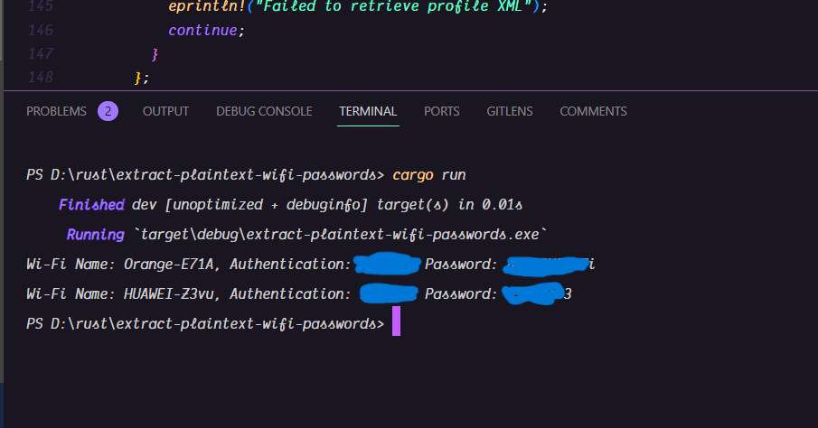

# Extract Plaintext Wi-Fi Passwords

This project is make to retreive all your wifi passwords you used before


## Screenshots




## Tech Stack

**Server:** Rust


## Run Locally

Clone the project

```bash
  git clone https://link-to-project
```

Go to the project directory

```bash
  cd my-project
```

Install dependencies

```bash
  cargo build
```

Start the server

```bash
  cargo run
```

